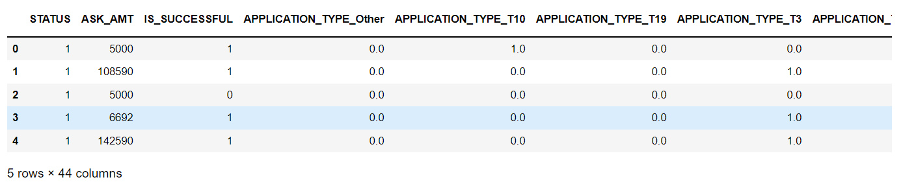
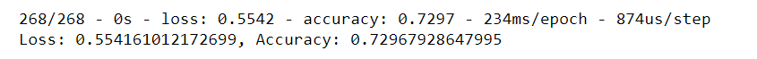
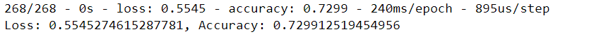

# **Neural Network Charity Analysis**

## **Overview**
Alphabet Soup is a philanthropic foundation dedicated to helping organizations that protect the environment, improve people's well-being and unify the world. They donate billions of dollars to organizations. However, not every donation the company makes is impactful. In some cases an organization will take the money and disappear.

Alphabet Soup would like to ensure money is used effectively and thus would like to create a method of predicting  which organizations are worth donating to and which are too high risk. To fulfill that request, this project will utilize neural networks to implement a binary classifier that is capable of predicting whether applicants will be successful if funded by Alphabet Soup.

 

## **Results**

### Data Preprocessing

Q. What variable(s) are considered the target(s) for your model? 
A. The 'IS_SUCCESSFUL' column is the target for the model.

 

Q. What variable(s) are considered to be the features for your model? 
A. Every other column except for 'IS_SUCCESSFUL', 'EIN' and 'NAME' are considered features of the model.

 

Q. What variable(s) are neither targets nor features, and should be removed from the input data? 
A. The ID columns 'EIN' and 'NAME' are non-beneficial and should be removed from the input data.

 

 

     
    Figure 1 (Preprocessed Data)

 

### Compiling, Training, and Evaluating the Model

Q. How many neurons, layers, and activation functions did you select for your neural network model, and why? 
A. One input layer, one hidden layer, and one ouput layer were used. The hidden layer was added in an attempt to capture any hidden effects that the multiple features could have on the target variable. A variety of neurons were tested (minimum: 13 and maximum: 44), however, as testing showed little impact to the accuracy, the neurons were left at a total of 31 which is 2/3 of the features plus 1 for the output layer. Lastly, the ReLu function was used in both the input and hidden layer, and the sigmoid function was used for the output layer. The ReLu function was chosen as the data was positive and nonlinear and the sigmoid function was chosen as the ouput is a binary classification. 

 

 

     
    Figure 2 (Original Model Performance)

 

Q. Were you able to achieve the target model performance? 
A. The target performance of 75% was not able to be achieved. The accuracy remained at approximately 73% during creation and attempted optimization of the model. 

 

Q. What steps did you take to try and increase model performance? 
A. While attempting to optimize the model multiple changes were attempted (Listed Below).

- Drop the 'STATUS' and 'SPECIAL_CONSIDERATIONS' columns.
- Increased the number of neurons to match the number of features.
- Increased the number of hidden layers from 1 to 2.
- Increased the number of epochs that the model trained on.
- Changed the input layer activation function from ReLu to Tanh.
- All of the above combined.

 

     
    Figure 3 (Optimized Model Performance - Best Attempt)

 

 

## **Summary**
The binary classifier using neural networks was unable to achieve the accuracy target of 75%. Based on the changes attempted during optimization, it is likely that there are still outliers present such as in the 'ASK_AMT' column or nosiy variables. It is also possible that there is insufficient or ineffective training data.

Further optimization of the current model may lead to eventually reaching the accuracy target. However, it would be recommended to try exploring an SVM model as it maybe able to solve this classification problem. SVMs are limited in their potential and can  miss critical features and high-dimensionality relationships that a well-trained deep learning model could find. However, SVMs would be a good choice as they excel in binary classification and are less prone to overfitting because they are trying to maximize the distance, rather than encompass all data within a boundary.
